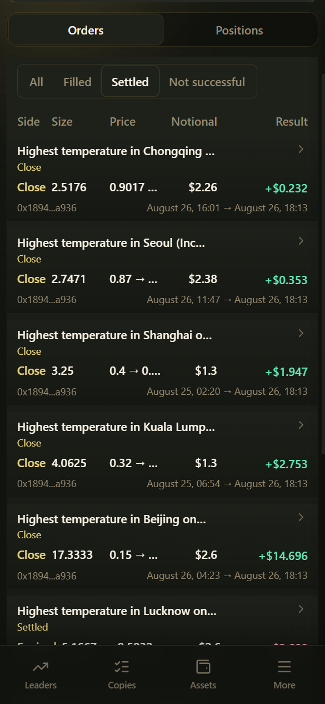

# How Copy Trading Works

Once copying is on, CopyOdds **tries** to place orders in your trading account according to your rules whenever a trader you follow gets a fill.

**Whether a copy succeeded is determined by Trade history**; Copy activity only shows the trader's public actions.

***

## Execution flow

1. Detect the leader's public fill (buy / sell) on Polymarket
2. Look up your copy rule for that address and check that the direction matches
3. Calculate the target notional amount from a **fixed amount** or a **percentage of your available USDC**
4. Try to place the order within your slippage tolerance
5. On a fill, deduct the corresponding **Platform Gas** (about 0.5% of notional) and update positions / records

***

## Filled vs. Skipped vs. Failed

| Result | Meaning |
|--------|---------|
| **Filled** | The copy order was filled |
| **Skipped** | No order was placed due to settings, funds, etc. (common) |
| **Failed** | The order was rejected or errored |
| **Settled, etc.** | Settlement / completed states as shown by the UI filters |

### Common skip reasons

- Direction mismatch (Buy only / Sell only)
- Amount below the minimum buy of about **$1**
- Reached **Max open copy buys** (default 1 = no adding to positions)
- Slippage too large
- **Insufficient Gas** or **insufficient USDC**
- The trader sold but you don't hold the matching position
- No counterparty in the market at the moment

***

## What happens to rules when funds run low?

| Situation | Rule status | Buys | Sells (when you hold positions) |
|-----------|-------------|------|---------------------------------|
| Gas = 0 | Usually still "running"; a funding alert may appear | Skipped | May still be copied |
| Not enough USDC to buy | Same as above | Skipped | May still be copied |
| Manually paused | Manually paused | Not copied | Not copied |

After topping up Gas / USDC, go to **My copies** and tap **Resume buys** (if the whole rule was manually paused, tap Resume instead).

***

## Copy activity vs. Trade history vs. Positions

| Page | Content |
|------|---------|
| Copy activity | The trader's public buys and sells |
| Trade history | Your copy attempts and their results |
| Positions | Your current positions; Close / redeem settled shares |
| Daily P&L | Realized P&L curve by trading day |

Today's realized P&L is usually reset daily at a fixed time in your account's time zone (e.g. 8:00 AM); see the in-app description for specifics.
