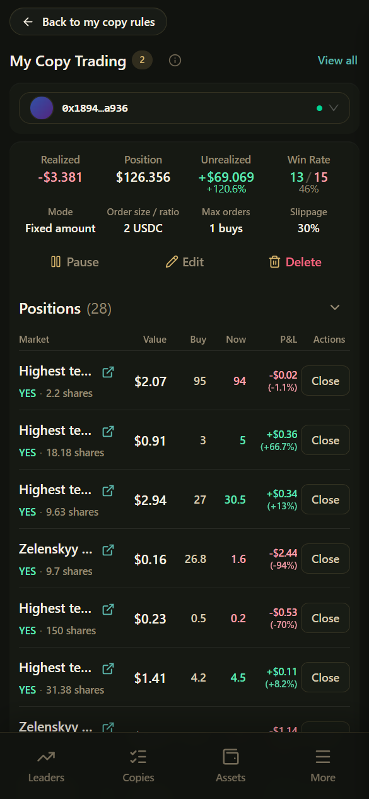

# Managing Copies

Manage all your copy rules in **My copies** → `/copy-rules`.

***

## Summary at the top of the page (common)

| Field | Meaning |
|-------|---------|
| Realized | P&L realized from closed positions |
| Position | Summary of current position market value |
| Unrealized | Floating P&L |
| Win Rate | Win / loss statistics |

If you haven't created any rules yet, the page may show an onboarding guide: Log in → Deposit → Buy Gas → Start copying.

***

## Rule statuses

| Status | Meaning | What to do |
|--------|---------|------------|
| **Following** | Copying normally | Just keep an eye on Trade history |
| **Manually paused** | You paused it yourself | Resume when needed |
| **Funding alert** | Buys are affected by funds / Gas issues | Deposit or buy Gas, then tap **Resume buys** |

> When funds run low, rules **often stay on** and only buys are skipped — this is by design, so that after topping up you can keep copying sells on existing positions.

***

## Actions on a single rule

| Action | Description |
|--------|-------------|
| Pause / Resume | Pause or resume the whole rule |
| Resume buys | Clear the funding alert and continue copying buys |
| Edit | Change amount, percentage, slippage, etc. |
| Delete | Delete the rule (history is usually kept) |
| Positions / Activity / Detail | Jump to positions, activity, or the profile |

Bulk pause / resume / delete is also supported (see the UI).

***

## Pause vs. Delete

| | Pause | Delete |
|--|-------|--------|
| Can you quickly restore it later? | Yes, Resume | Must recreate the rule |
| Trade history | Kept | Usually kept |
| Existing positions | **Not** sold automatically | **Not** sold automatically |

Close positions yourself in **Positions**, or wait for settlement and redeem.

***

## Related pages

| Page | Path | Purpose |
|------|------|---------|
| Copy activity | `/feed` | See leaders' public fills and copy status tags |
| Trade history | `/executions/records` | Your fill results |
| Positions | `/executions/positions` | Positions and closing |
| Daily P&L | `/executions/daily-pnl` | Daily realized P&L |

Status tags in Copy activity help you understand "whether this public fill was attempted"; **Trade history is the final word**.

***

## Learn more

- Why each trade was or wasn't copied: [Copy Activity](copy-activity.md)
- Positions and settlement: [My Positions & Trade History](positions-and-records.md)
- Try it without spending real money: [Simulation Copy Trading](simulation.md)
