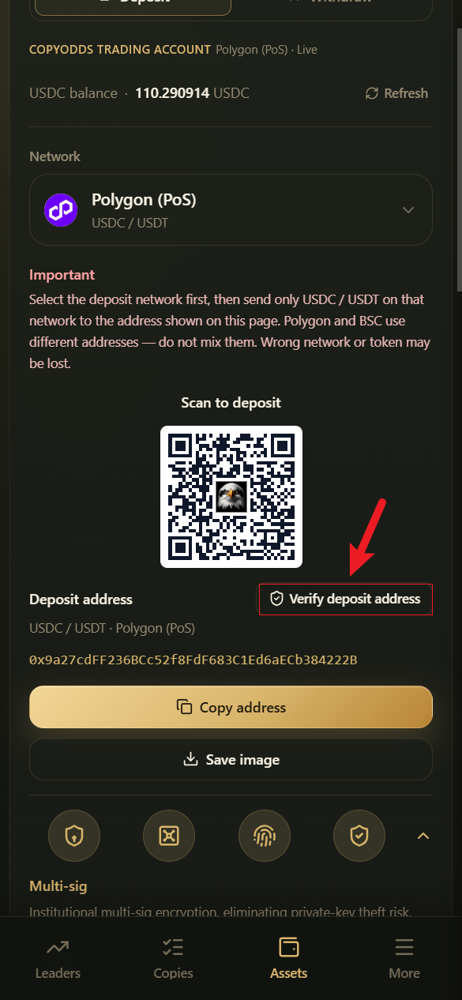

# Anti-Phishing

Common phishing tactics include fake websites, fake support agents, and fake airdrops designed to steal verification codes or trick you into sending funds to the wrong address. Keep the following in mind.

***

## Only trust these

| Item | Correct example |
|------|-----------------|
| Website / App domain | **copyodds.io** / **app.copyodds.io** |
| System emails | **noreply@copyodds.io** (based on the actual official domain) |
| Deposit address source | Only copy the address shown on the deposit page after logging in |
| Address verification | Use **Verify deposit address** in the App and check it in the official Telegram bot or your linked email |

Pages like Smart money may also show a scrolling security banner at the top with the same information.

***

## CopyOdds will never

- Ask for your **seed phrase / private key**
- Ask you to send verification codes to "support"
- Require you to install an unknown APK / browser extension to "unfreeze withdrawals"
- Send "wallet upgrade" links on unofficial domains asking you to sign away all your assets

***

## Deposit safety checklist

1. Open the official website yourself; don't click links in unsolicited DMs
2. Check the domain in your browser's address bar
3. Pick the right network before copying the address
4. Double-check with **Verify deposit address**
5. Start small, then deposit more after it arrives

***

## Withdrawal safety checklist

1. The receiving address comes from your own wallet / exchange withdrawal address book
2. The network must be Polygon USDC
3. Step-up verification is only completed in the official App dialog
4. Anyone urging you to "withdraw to some address right now" → treat it as suspicious

***

## If you notice something suspicious

- Stop immediately and don't enter any more verification codes
- Check your devices and Passkeys in Settings
- If needed, secure your email (with your email provider) and contact official support
- Keep screenshots of phishing links and chat logs for investigation
