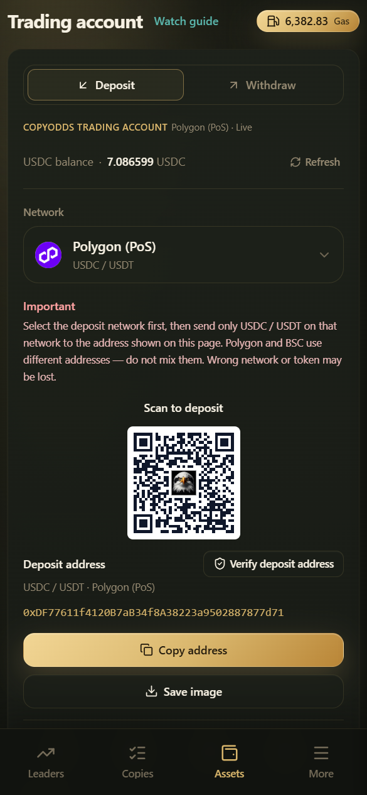

# Deposit

Deposit USDC / USDT into your CopyOdds **trading account** to use as copy principal. Entry: **Wallets → Deposit** → `/wallets/deposit`.

***

## Deposit in four steps

1. **Pick network** — Polygon (PoS) or BSC, matching the network you withdraw from on your exchange  
2. **Pick asset** — **USDC** or **USDT** only  
3. **Send** — Copy or scan **the address shown on this page**  
4. **Wait** — Your balance updates after on-chain confirmation; BSC may take a few extra minutes

***

## Important rules

| Rule | Description |
|------|-------------|
| Address depends on network | The Polygon custodial address and the BSC bridge address are **different** — never mix them up |
| USDC / USDT only | Other tokens usually can't be credited |
| Don't use the wrong chain | Don't use unsupported networks such as Ethereum / Arbitrum |
| Verify the address | Tap **Verify deposit address** to check it via the official Telegram bot or your linked email |

The platform may bridge / swap some assets before crediting them to your tradable balance; native USDC can sometimes take a few extra minutes.

***

## Details

1. Log in and confirm your trading account is active
2. On the deposit page, pick the network first, then copy the address
3. When withdrawing from your exchange or wallet: carefully check the network, token, and amount
4. Return to CopyOdds and pull to refresh your balance if needed
5. Before your first large deposit: deposit a small amount → confirm it arrives → then deposit more

***

## Deposit slow or missing?

Check in this order:

1. Does the withdrawal network match the one selected on this page (Polygon vs. BSC)?
2. Is the token USDC / USDT?
3. Is the receiving address **exactly the same** as on this page?
4. Is the on-chain transaction confirmed? (Look up the hash on the corresponding block explorer)
5. Did you send it to a withdrawal destination or another platform's address by mistake?

Still missing: contact support with the **transaction hash, network, amount, time, and registered email**.

***

## What's next after depositing?

- To start copying, you also need to **buy Platform Gas** (see [Platform Gas](gas.md))
- Copy buys need available USDC (at least about $1 recommended)
