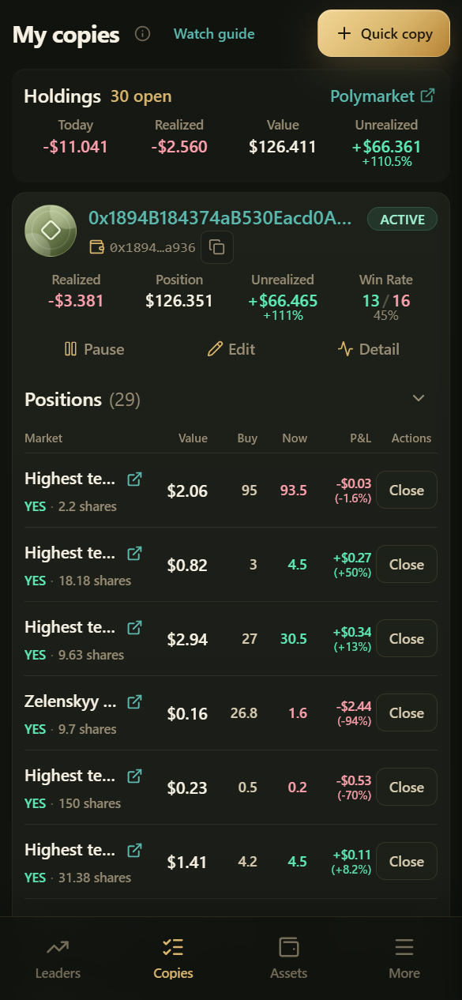

# Gérer vos copies

Gérez toutes vos règles de copie dans **My copies** (mes copies) → `/copy-rules`.

***

## Récapitulatif en haut de la page (courant)

| Champ | Signification |
|-------|---------|
| Realized | P&L réalisé sur les positions clôturées |
| Position | Récapitulatif de la valeur de marché des positions actuelles |
| Unrealized | P&L flottant |
| Win Rate | Statistiques de gains / pertes |

Si vous n'avez encore créé aucune règle, la page peut afficher un guide de prise en main : Se connecter → Déposer → Acheter du Gas → Commencer à copier.

***

## Statuts des règles

| Statut | Signification | Que faire |
|--------|---------|------------|
| **Following** | Copie normale | Gardez simplement un œil sur Trade history |
| **Manually paused** | Vous l'avez mise en pause vous-même | Reprenez-la si nécessaire |
| **Funding alert** | Les achats sont affectés par des problèmes de fonds / de Gas | Déposez des fonds ou achetez du Gas, puis appuyez sur **Resume buys** (reprendre les achats) |

> Lorsque les fonds manquent, les règles **restent souvent actives** et seuls les achats sont ignorés — c'est voulu, afin qu'après un rechargement vous puissiez continuer à copier les ventes sur les positions existantes.

***

## Actions sur une règle

| Action | Description |
|--------|-------------|
| Pause / Resume | Mettre en pause ou reprendre l'ensemble de la règle |
| Resume buys | Lever l'alerte de financement et continuer à copier les achats |
| Edit | Modifier le montant, le pourcentage, le slippage, etc. |
| Delete | Supprimer la règle (l'historique est généralement conservé) |
| Positions / Activity / Detail | Accéder aux positions, à l'activité ou au profil |

La mise en pause / reprise / suppression groupée est également prise en charge (voir l'interface).

***

## Pause vs Suppression

| | Pause | Suppression |
|--|-------|--------|
| Pouvez-vous la restaurer rapidement plus tard ? | Oui, avec Resume | Il faut recréer la règle |
| Trade history | Conservé | Généralement conservé |
| Positions existantes | **Non** vendues automatiquement | **Non** vendues automatiquement |

Clôturez vous-même les positions dans **Positions**, ou attendez le règlement et récupérez-les.

***

## Pages associées

| Page | Chemin | Objectif |
|------|------|---------|
| Copy activity | `/feed` | Voir les exécutions publiques des traders suivis et les étiquettes de statut de copie |
| Trade history | `/executions/records` | Les résultats de vos exécutions |
| Positions | `/executions/positions` | Positions et clôture |
| Daily P&L | `/executions/daily-pnl` | P&L réalisé quotidien |

Les étiquettes de statut de Copy activity vous aident à comprendre « si cette exécution publique a fait l'objet d'une tentative » ; **Trade history fait foi**.

***

## En savoir plus

- Pourquoi chaque trade a été copié ou non : [Activité de copie](copy-activity.md)
- Positions et règlement : [Mes positions et historique des trades](positions-and-records.md)
- Essayez sans dépenser d'argent réel : [Copy trading en simulation](simulation.md)
