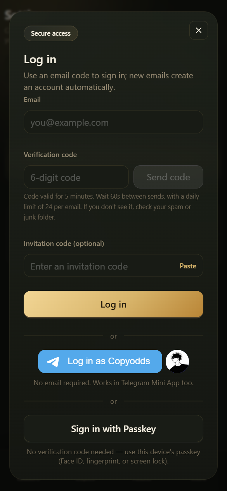

# Démarrage rapide

Suivez ces étapes pour passer de l'ouverture de l'App à votre première règle de copie. Utilisez toujours les domaines officiels **copyodds.io / app.copyodds.io**.

***

## 1. Se connecter ou créer un compte

1. Ouvrez l'App et allez sur **Login** (connexion).
2. Saisissez votre e-mail → **Send code** (envoyer le code) → saisissez le code à 6 chiffres → connectez-vous.
3. **Une nouvelle adresse e-mail crée automatiquement un compte** (pas de page d'inscription séparée avec votre nom ; si l'écran vous demande encore un nom / l'acceptation des conditions, suivez simplement les instructions).
4. Facultatif : connectez-vous avec une **Passkey** ou **Telegram**.
5. Si vous arrivez via un lien d'invitation, le code d'invitation est généralement rempli automatiquement.

### Remarques

- Les codes sont généralement valables environ 5 minutes ; vous ne pouvez pas en renvoyer un immédiatement après l'envoi
- Si l'e-mail n'arrive pas, vérifiez votre dossier spam / promotions
- Les Passkeys doivent être enregistrées sur un appareil et un navigateur pris en charge (gérez-les dans les paramètres)

***

## 2. Déposer des USDC / USDT

1. Ouvrez **Assets / Deposit** (actifs / dépôt) → `/wallets/deposit`
2. **Choisissez un réseau** : Polygon (PoS) ou BSC (doit correspondre au réseau depuis lequel vous retirez sur votre plateforme d'échange)
3. **Choisissez un actif** : USDC ou USDT uniquement
4. Copiez l'adresse affichée sur cette page ou scannez le QR code pour effectuer le transfert (**les adresses Polygon et BSC sont différentes — ne les confondez jamais**)
5. Attendez la confirmation on-chain ; BSC peut prendre quelques minutes de plus

Consultez [Dépôt](../wallet/deposit.md) et [Réseaux pris en charge](../wallet/supported-networks.md) pour plus de détails.

***

## 3. Acheter du Gas de la plateforme

1. Ouvrez **Gas Store** → `/store`
2. Vérifiez vos soldes actuels de Gas et d'USDC
3. Choisissez un forfait → payez avec vos USDC en garde
4. Le Gas est crédité instantanément (non retirable)

Les frais en bref : chaque exécution copiée coûte environ **0.5%** de son montant notionnel en Gas ; **1 USDC ≈ 100 Gas**. Voir [Gas de la plateforme](../wallet/gas.md).

***

## 4. Choisir un trader et le copier

1. Ouvrez la page d'accueil **Leaderboard** ou **Smart money** → `/` ou `/smart-money`
2. Utilisez les catégories, les filtres rapides ou les filtres avancés pour choisir un trader
3. Appuyez sur **Follow** (suivre), ou ouvrez d'abord le profil et suivez le trader depuis celui-ci
4. Choisissez un **mode de copie** (par défaut **Ratio**), le slippage et les options avancées
5. Assurez-vous que Gas > 0, puis enregistrez → gérez la règle dans **My copies** (mes copies)

***

## 5. Vérifier que la copie fonctionne

| Page | Objectif |
|------|---------|
| **My copies** | Si la règle est active et s'il y a une alerte de financement |
| **Trade history** | Si vos ordres ont été exécutés / ignorés / ont échoué |
| **Copy activity** | Les actions publiques du trader (**pas** vos exécutions) |
| **Positions** | Vos positions actuelles ; clôturez / récupérez ici |

***

## Conseils pour les débutants

- Commencez par un petit dépôt, achetez un peu de Gas et testez avec un petit montant fixe pendant 1 à 2 jours
- Lorsque les fonds ou le Gas viennent à manquer, les achats sont ignorés mais la règle **ne se met généralement pas** en pause automatiquement ; après avoir rechargé, allez dans **My copies** et appuyez sur **Resume buys** (reprendre les achats)
- Les retraits ne prennent en charge que les **USDC sur Polygon** — vérifiez bien l'adresse avant de soumettre

***

## Vous ne savez pas qui copier ? Deux approches sûres

1. **Consultez d'abord le Leaderboard** (page d'accueil) pour trouver des comptes aux performances récentes régulières, puis vérifiez le score et le drawdown sur la page de profil
2. **Toujours pas sûr ? Essayez d'abord le [Copy trading en simulation](../copy-trading/simulation.md)** — aucun argent réel n'est engagé

Une fois en confiance, revenez à l'étape 4 de cette page pour commencer la copie en réel.
