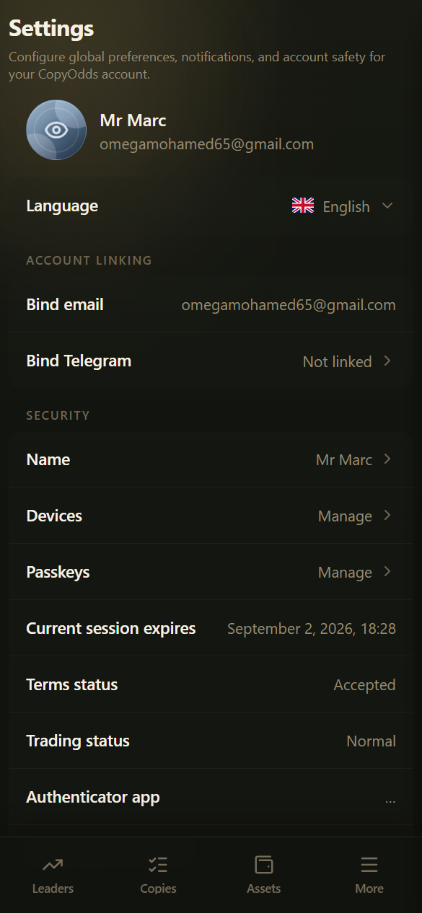

# Authentification à deux facteurs (2FA)

Par défaut, CopyOdds vous connecte avec un **code de vérification par e-mail** (pas de mot de passe traditionnel). Nous vous recommandons d'activer à la fois un Authenticator et une Passkey pour renforcer respectivement la sécurité des retraits et celle de la connexion.

***

## Méthodes disponibles

| Méthode | Objectif |
|--------|---------|
| **Email OTP** | Connexion, vérification lors des associations |
| **Authenticator (TOTP)** | **Vérification renforcée des retraits (la seule méthode)** ; renforce également la sécurité du compte |
| **Passkey** | Visage / empreinte digitale / verrouillage d'écran pour une vérification rapide de la **connexion** |
| **Telegram** | Méthode de connexion / d'association facultative (voir les paramètres) |
| **Gestion des appareils** | Consulter et supprimer des appareils ; les nouveaux appareils peuvent affecter les retraits |

***

## Ordre de configuration recommandé

1. Associez et vérifiez votre e-mail
2. **Activez l'Authenticator (obligatoire avant de retirer)**
3. Ajoutez une **Passkey** sur les appareils que vous utilisez souvent (pour vous connecter plus facilement)
4. Familiarisez-vous avec la liste **Devices** et supprimez tout appareil que vous ne reconnaissez pas

***

## Authenticator (TOTP)

1. Ouvrez **Settings → Security**
2. Suivez le guide pour scanner le QR code avec votre application Authenticator, ou saisissez la clé manuellement
3. Saisissez le code à 6 chiffres pour terminer l'activation

Si vous êtes arrivé ici depuis le processus de retrait, vous serez **automatiquement redirigé vers la page Portefeuille pour poursuivre le retrait** une fois l'opération terminée.

### Désactiver l'Authenticator

Pour des raisons de sécurité, **la désactivation nécessite également un code à 6 chiffres**. Si vous voulez simplement changer d'appareil, il est plus simple de le réassocier sur le nouvel appareil.

### Messages courants

| Message | Cause | Que faire |
|---------|-------|------------|
| Code erroné ou expiré | Faute de frappe, ou plus de 30 secondes écoulées | Attendez un nouveau code et saisissez-le |
| Code déjà utilisé | Le même code a été soumis deux fois | Attendez le prochain nouveau code |
| Association expirée | Trop de temps entre le scan et la confirmation | Recommencez l'association |
| Trop de tentatives | Trop de saisies erronées en peu de temps | Patientez un moment et réessayez |
| Authenticator déjà activé | Deuxième tentative d'association | Inutile de recommencer |

***

## Passkey

1. Ouvrez les paramètres dans un navigateur / système d'exploitation pris en charge
2. Ajoutez une Passkey et effectuez la vérification biométrique ou par verrouillage d'écran comme indiqué
3. Sur la page de connexion, vous pouvez choisir Passkey pour une connexion rapide

Remarque : une Passkey **ne peut pas** être utilisée pour confirmer les retraits. La prise en charge varie selon les navigateurs, les WebViews et les versions de système d'exploitation ; si la connexion échoue, revenez au code par e-mail.

***

## Appareils et sessions

- Consultez les appareils connectés sur `/settings/devices`
- Après une connexion sur un nouvel appareil ou dans un nouvel environnement, **les retraits peuvent être temporairement bloqués** pendant un certain temps (délai de carence de sécurité)
- Sur les ordinateurs publics, ne faites pas confiance durablement à des extensions inconnues et n'enregistrez pas de codes dans des endroits non sécurisés

***

## Vous avez perdu votre authenticator ?

Si vous avez toujours accès à votre e-mail :

1. Connectez-vous avec un code par e-mail
2. Réassociez l'Authenticator (et les Passkeys dont vous avez besoin) dans les paramètres
3. Vérifiez la liste des appareils et supprimez l'appareil perdu

Si vous n'avez pas non plus accès à votre e-mail : contactez le support et préparez des justificatifs de vérification d'identité (selon la procédure du support).
