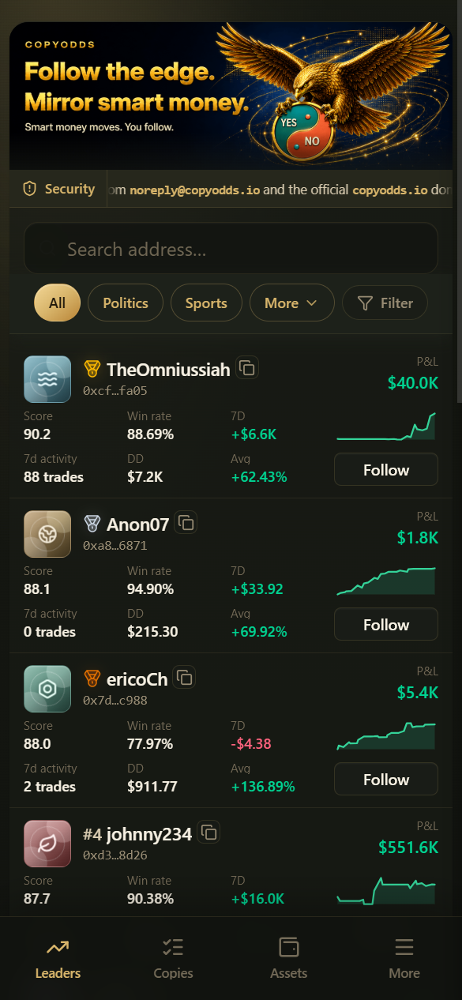

# Classement Smart Money (filtrer par profil de trader)

Le classement Smart Money vous aide à trouver des traders Polymarket qui valent la peine d'être copiés. Accès : **Smart money** → `/smart-money` (la page d'accueil de l'App est désormais le [Classement des profits quotidiens du pool de copie](copy-pool-board.md) ; ouvrez Smart money depuis le menu).

***

## Ce que vous pouvez faire ici

1. **Parcourir le classement** — Consultez le P&L, le score, le taux de réussite, les 7 derniers jours et plus encore, sous forme de cartes ou de tableau
2. **Rechercher des adresses** — Trouvez un trader par son adresse de portefeuille
3. **Filtrer** — Catégories, préréglages rapides et filtres avancés (niveau, style, plages d'indicateurs, copiabilité, etc.)
4. **Période de classement** — Global / Hebdomadaire / Mensuel (par défaut, il s'agit généralement du classement global, qui n'est pas simplement trié par score global)
5. **Copier** — Appuyez sur **Follow** (suivre) pour ouvrir les paramètres de copie, ou ouvrez d'abord le profil et décidez depuis celui-ci

***

## Comment les données du classement sont calculées (à lire absolument)

- Les courbes de P&L, le profit des 7 derniers jours / total, etc. proviennent généralement des données PnL officielles de Polymarket
- Le taux de réussite, le profit factor, etc. reposent principalement sur les **marchés clôturés**
- Les scores et les indicateurs de backtest reposent sur les **exécutions d'une fenêtre récente** (environ 30 jours / jusqu'à environ 4,000 trades), **et non sur l'historique complet**
- Le **classement affiché** n'inclut généralement que les adresses dont le score global atteint un seuil (par ex. ≥ 40) ; les adresses dont le score reste bas peuvent en sortir
- « Copy fit / backtest P&L / slippage » et indicateurs similaires sont principalement des **simulations supposant un délai + du slippage**, et non le P&L réel des utilisateurs qui copient sur la plateforme

> Le classement **ne constitue pas un conseil en investissement**. Les performances passées ne garantissent pas les rendements futurs.

***

## Filtres courants

### Exemples de catégories

Tout, Politique, Sport, Esport, Crypto, Culture, Météo, Économie, Tech, Finance, Mentions, et plus encore.

### Exemples de filtres rapides

| Préréglage | Objectif approximatif |
|--------|---------------|
| Featured | Traders mis en avant par la plateforme, plutôt copiables |
| Steady | Style relativement prudent |
| High copyability | Plus faciles à suivre en simulation |
| Recently active | Trading plus fréquent sur la fenêtre récente |
| All copyable | Adresses disponibles pour la copie |
| High win rate / High return / Low drawdown | Affiner selon l'indicateur correspondant |
| Long-term stable | Candidats plus réguliers |

### Filtres avancés (options courantes)

- Adresses copiables uniquement / Mises en avant uniquement (hors market makers)
- Niveau (S–D), style de trading
- Plages d'indicateurs (par ex. trades des 7 derniers jours, taux de réussite)
- Exclure certaines étiquettes de risque
- Copiabilité : Élevée / Moyenne / Faible

***

## Étiquettes de style de trading (à titre indicatif)

| Étiquette | Signification (simplifiée) |
|-----|----------------------|
| Avantage informationnel | Tend à se positionner tôt / guidé par l'information |
| Arbitrage | Schémas de spread / d'arbitrage |
| Parieur | Schémas de paris à forte volatilité ; copiez avec une prudence accrue |
| Market maker | Tenue de marché à haute fréquence ; généralement inadapté à la copie classique |
| Mixte | Style mixte général |

***

## Suggestions

1. Commencez par des préréglages comme Featured / High copyability / Steady pour réduire le champ
2. Ouvrez le profil pour examiner les facteurs du score, le drawdown et les notes de risque
3. Suivez avec un petit montant pour tester, puis ajustez progressivement
4. Pour partager un trader, utilisez le format de lien de profil : `https://app.copyodds.io/@0xADDRESS` (ajoutez `/zh` pour l'interface chinoise)

***

## Pages associées

- **Leaderboard** de la page d'accueil (profit quotidien du pool de copie) : [Classement des profits quotidiens du pool de copie](copy-pool-board.md)
- Comment aborder le choix des traders : [Comment choisir un trader](how-to-choose.md)
