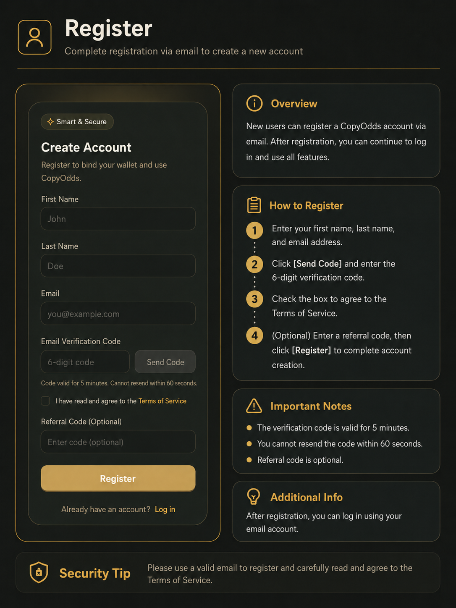
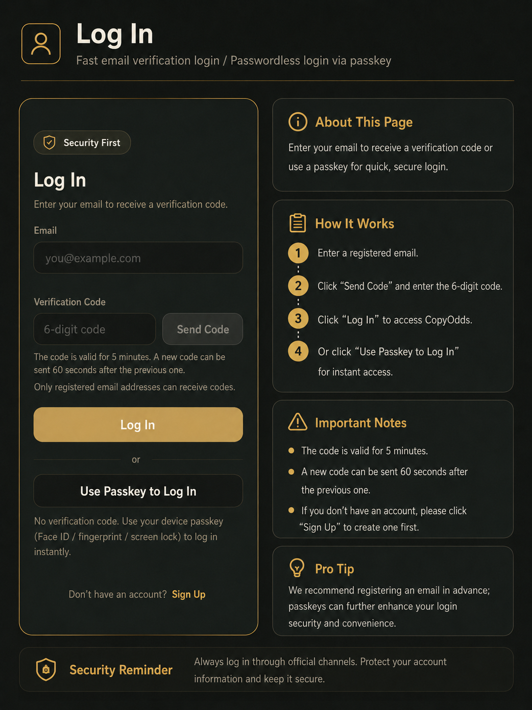

# 注册与登录

新用户需先注册 CopyOdds 账户；已注册用户可通过邮箱验证码或通行密钥（Passkey）登录。登录后系统通常会自动完成交易账户开通与 Polymarket 授权。

---

## 注册账户

新用户可通过邮箱创建 CopyOdds 账户。

### 操作步骤

1. 打开 CopyOdds 官网，点击「**注册**」进入创建账户页面。
2. 在「名」和「姓」输入框中填写姓名或常用昵称。
3. 在「邮箱」输入框中填写可正常接收邮件的地址。
4. 点击「**发送验证码**」，打开邮箱查看 6 位数字验证码并填入。
5. 阅读服务条款，勾选「我已阅读并同意《服务条款》」。
6. 如有邀请码可填写（选填），点击「**注册**」完成创建。

*注册页：填写姓名、邮箱与验证码后完成注册。*

### 注意事项

- 邮箱地址必须填写正确；验证码一般 5 分钟内有效。
- 发送验证码后短时间内不可重复发送；收不到请检查垃圾邮件箱。
- 未勾选服务条款无法完成注册；邀请码为选填项。

### 常见错误

- 邮箱格式错误、验证码过期或输入错误
- 忘记勾选服务条款、邀请码填写错误

---

## 登录账户

已注册用户通过邮箱验证码登录；已绑定 Passkey 的用户可使用通行密钥快速登录。

### 操作步骤

1. 打开 CopyOdds 官网，点击「**登录**」。
2. 输入注册时使用的邮箱地址。
3. 点击「发送验证码」，将邮箱中的 6 位验证码填入。
4. 点击「**登录**」进入 CopyOdds。

*登录页：输入邮箱与验证码，或使用通行密钥快捷登录。*

### Passkey 登录（可选）

1. 在登录页选择「使用通行密钥登录」。
2. 按浏览器或设备提示完成面容、指纹或屏幕锁验证。
3. 验证成功后进入账户。

### 注意事项

- 登录邮箱必须是注册时使用的邮箱；未注册会提示先注册。
- 登录后系统会自动开通交易账户并完成 Polymarket 授权，一般无需手动操作。
- Passkey 需提前在设置页面绑定；不同浏览器与设备支持程度可能不同。
