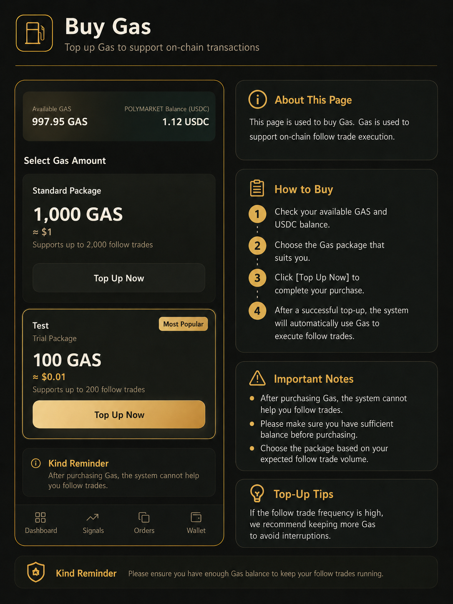

# 钱包与资金

CopyOdds 使用 Polygon 网络上的稳定币作为跟单交易本金；平台 Gas 是账户内的服务点数，用于支付自动跟单产生的服务费。

**平台 Gas 不是链上的 MATIC / POL，两者不是同一个东西。**

***

## 充值

向 CopyOdds 钱包页显示的 **托管地址** 转入支持的稳定币，到账后即可用于跟单。

### 支持的资产（须选 Polygon POS）

| 资产 | 说明 |
|------|------|
| **USDC.e** | 推荐，到账通常更快 |
| **USDC**（原生） | 支持，可能多等几分钟 |
| **USDT0**（PoS） | 交易所提 Polygon「USDT」多数是这个；经官方 Bridge，可能略有损耗 |
| **Wormhole Bridged USDT** | 同样支持；经 Bridge，可能多等几分钟 |

你 **不需要** 自己兑换或桥接，平台会自动入账。

### 操作步骤

1. 登录 CopyOdds，确认交易账户已开通（通常登录后自动完成）。
2. 进入「**钱包**」页面。
3. 找到充值区域。
4. 确认网络为 **Polygon（POS）**，资产为上表之一。
5. 扫描二维码，或复制页面显示的充值地址（**托管地址**）。
6. 在外部钱包（如 MetaMask）或交易所发起转账：网络选 **Polygon**；充 USDT 时选 Polygon，常见到账为 **USDT0**。
7. 仔细核对地址和网络后提交，等待链上确认。
8. 回到 CopyOdds 钱包查看余额；若未更新，点击「刷新余额」。USDT / 原生 USDC 经 Bridge 可能比 USDC.e 多等几分钟。

_钱包充值页：确认 Polygon 与支持资产，扫码或复制地址转账。_

### 注意事项

* **只支持** Polygon 网络上的 **USDC.e / USDC / USDT0 / Wormhole USDT**。
* **不要**从 BSC、Ethereum 主网等其它链转入 USDT 或 USDC；选错网络无法自动到账，误转可能无法找回。
* 请始终使用钱包页展示的充值地址，不要自行查找或替换地址；不要向 Deposit 地址自行充值。
* 建议准备足够资金用于跟单买入（每笔买入至少需要约 **$1**）。

### 常见错误

* 从 **BSC** 或 Ethereum 主网提现 USDT / USDC（最常见误操作）
* 选错网络或币种
* 未等链上确认就反复发起多笔小额转账

***

## 购买平台 Gas

平台 Gas 是 CopyOdds 账户内的服务点数。跟单需要 Gas 大于 0；Gas 用完后跟单会自动暂停。

### 操作步骤

1. 进入「**商店 / Store**」页面。
2. 查看当前 **Gas 余额** 和 **USDC 可用余额**。
3. 选择合适的 Gas 套餐。
4. 点击「**立即购买**」，在确认弹窗核对套餐内容和需支付的 USDC 金额。
5. 确认后系统从 USDC 余额扣款，Gas 点数到账。
6. 若跟单曾因 Gas 不足暂停，购买成功后系统会**自动恢复**跟单；若未恢复，可到跟单页手动点「恢复跟单」。

_商店页：选择 Gas 套餐并从 USDC 余额扣款购买。_

### 费率说明

* 每笔跟单按名义金额的约 **0.5%** 扣除 Gas（例：$100 跟单约消耗 50 Gas 点数）。
* 每 **1 USDC** 可兑换 **100 Gas** 点数。
* 平台 Gas 不可提现、不可转让。

### 注意事项

* USDC 用于跟单本金，Gas 用于服务费，两者分开计算。
* 不要把 MATIC / POL 与平台 Gas 混淆。

***

## 提现 USDC

将账户中可自由支配的 USDC 提现到 Polygon 网络上的外部钱包地址。

### 操作步骤

1. 进入「**钱包**」页面，打开「提现 USDC」区域。
2. 查看「**最大可提**」金额（可能小于页面显示的总余额）。
3. 输入有效的 Polygon 收款地址。
4. 输入提现金额（不超过最大可提），点击「下一步」。
5. 核对网络、地址与金额，完成二次验证（邮箱验证码、Passkey 等）。
6. 确认提交后，在提现记录中跟踪状态。

_提现页：输入收款地址与金额，完成二次验证后提交。_

### 注意事项

* 仅支持提现到 Polygon 网络上可接收 USDC 的地址。
* 未平仓位、未成交挂单会占用部分余额，以「最大可提」为准。
* 提现提交后通常无法撤销，提交前务必核对地址每一位字符。

### 为什么可提金额小于余额

* 跟单或手动交易产生的未平仓位会占用一部分资金。
* 未成交的挂单也会冻结部分余额。
* 请以钱包页「最大可提」为准，不要按总余额全额提现。
