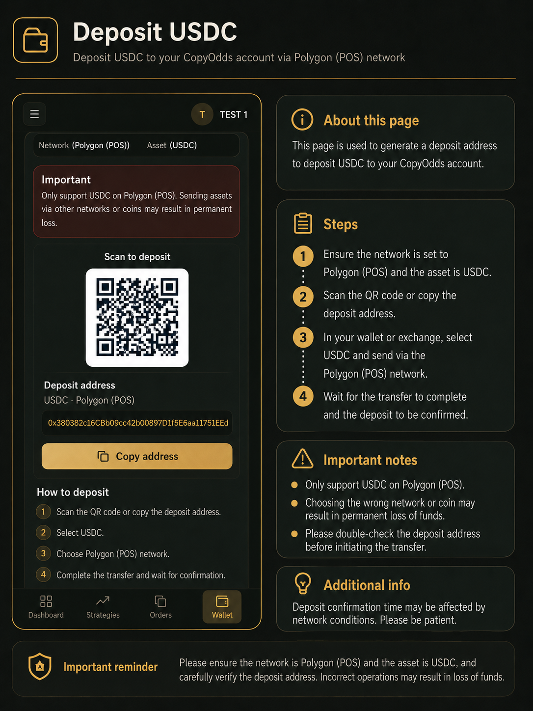
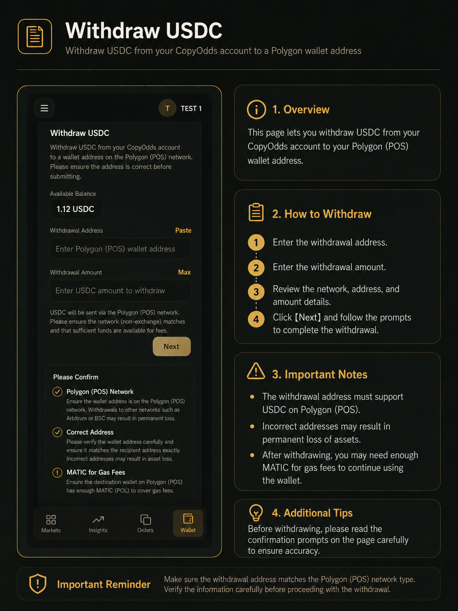

# 钱包与资金

CopyOdds 使用 Polygon (POS) 网络上的 USDC 作为跟单交易本金；平台 Gas 为账户内服务点数，用于支付自动跟单产生的服务费（**不是**链上的 MATIC / POL）。

跟单启动门槛约为 **$10 USDC**，且需 **Gas > 0** 才能持续自动跟单。

---

## 充值 USDC

通过 Polygon (POS) 网络向 CopyOdds 账户充值 USDC。到账后系统会自动同步入账，用于 Polymarket 跟单交易本金。

### 操作步骤

1. 登录 CopyOdds，确认交易账户与 Polymarket 授权已完成（通常登录后自动完成）。
2. 进入「**钱包**」页面，找到「充值 USDC」区域。
3. 确认网络为 **Polygon (POS)**，资产为 **USDC**。
4. 扫描二维码或复制页面显示的 Polygon 充值地址（专属托管地址，勿与他人混用）。
5. 在外部钱包（MetaMask 等）或交易所发起转账：资产选 USDC，网络选 Polygon (POS)。
6. 仔细核对地址与网络后提交，等待链上确认。
7. 回到 CopyOdds 钱包查看余额；若未更新可点击「刷新余额」。

*钱包充值页：确认 Polygon (POS) 与 USDC，扫码或复制地址转账。*

### 注意事项

- **仅支持** Polygon (POS) 上的 USDC；其他链或币种（USDT、ETH、MATIC 等）无法自动入账，误转可能无法找回。
- 充值地址仅用于入账，与 Polymarket deposit 内部地址不同；请始终使用钱包页展示的地址。
- 跟单前建议至少准备约 $10 USDC，并购买 Gas。

### 到账后系统会做什么

- 扫块识别转入托管地址的 USDC，按 txHash 幂等入账。
- 必要时归集到 Polymarket deposit 并完成 wrap / 抵押准备，供 CLOB 下单使用。

### 常见错误

- 从 Ethereum 主网提现 USDC（最常见误操作）
- 把充值地址与提现收款地址混用
- 未等链上确认就反复发起多笔小额转账

---

## 购买平台 Gas

平台 Gas 是 CopyOdds 账户内的服务点数，用于支付自动跟单服务费。Gas 为 0 时跟单会自动暂停。

### 操作步骤

1. 进入「**商店 / Store**」页面。
2. 查看当前 **Gas 余额**（账户内点数，非链上代币）与 **USDC 可用余额**。
3. 选择合适的 Gas 套餐。
4. 点击「**立即购买**」，在确认弹窗核对套餐、Gas 数量与需支付的 USDC 金额。
5. 确认后系统从 Polymarket 交易余额扣款并增加 Gas 点数。
6. 若跟单曾因 Gas 不足暂停，需回到跟单页对每条规则点「**恢复跟单**」。

*商店页：选择 Gas 套餐并从 USDC 余额扣款购买。*

### 费率说明

- 按每笔跟单名义金额的约 **0.5%** 折算为 Gas 扣除（例：$100 名义跟单约消耗 50 Gas 点数）。
- 每 **1 USDC** 可兑换 **100 Gas** 点数。
- 平台 Gas 不可提现、不可转让。

### 注意事项

- Gas 与 USDC 是两种余额：USDC 用于跟单本金，Gas 用于服务费。
- 买 Gas 后若未点「恢复跟单」，跟单不会自动继续。
- 勿将 MATIC / POL 与平台 Gas 混淆。

---

## 提现 USDC

将 Polymarket 交易账户中可自由支配的 USDC 提现到 Polygon (POS) 上的外部钱包地址。

### 操作步骤

1. 进入「**钱包**」页面，打开「提现 USDC」区域。
2. 查看「**最大可提**」金额（可能小于账面总余额）。
3. 输入有效的 Polygon 收款地址（勿填充值地址或 Polymarket 内部地址）。
4. 输入提现金额（不超过最大可提），点击「下一步」。
5. 核对网络、地址与金额，完成二次验证（TOTP / Passkey / 邮箱验证码等）。
6. 确认提交后在提现记录中跟踪状态，可通过 txHash 在 Polygon 浏览器查询。

*提现页：输入收款地址与金额，完成二次验证后提交。*

### 注意事项

- 仅支持提现到 Polygon (POS) 可接收 USDC 的地址；跨链地址会导致失败或资产丢失。
- 未平仓位、未成交挂单、进行中的提现会限制可提金额。
- 提现提交后通常无法撤销；提交前务必核对地址每一位字符。

### 为什么可提金额小于余额

- 跟单或手动交易产生的未平仓位占用抵押。
- 未成交限价挂单冻结部分 CLOB 抵押。
- 以钱包页「最大可提」为准，不要按总余额自行估算。
