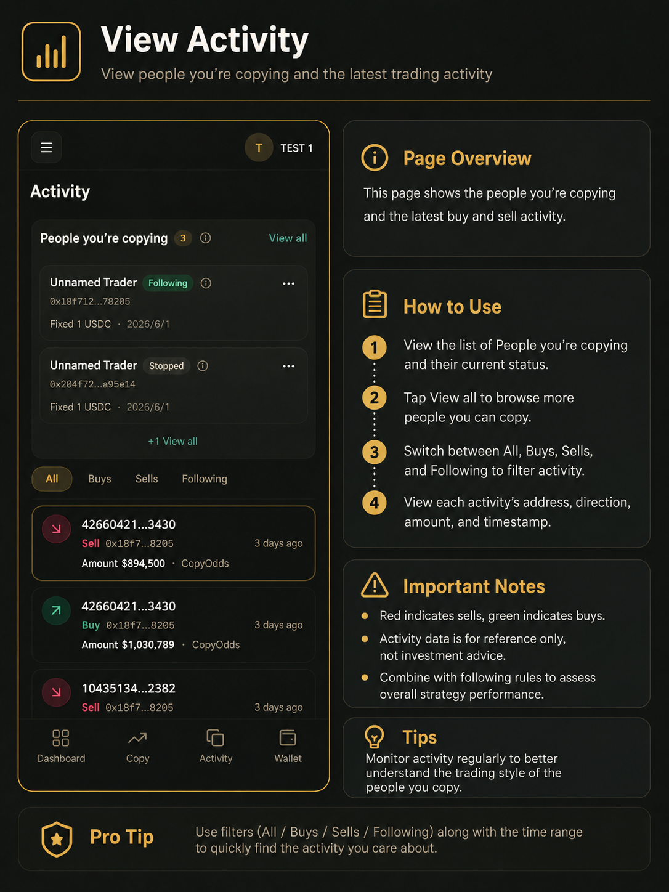

# 开始跟单

CopyOdds 监听您关注的 Polymarket 钱包在链上的成交，并通过 Polymarket CLOB 在您的账户下自动镜像下单。每个被跟单的钱包地址对应一条独立订阅规则。

**请以「交易记录」为准确认跟单是否成功**；「动态」仅展示 leader 的公开动作，不代表您的订单已成交。

---

## 跟单原理

### 完整执行流程

1. 系统捕获 leader 的买入或卖出（链上成交）。
2. 对该 leader 下每条已启用的订阅创建跟单任务（可按设置延迟）。
3. 按跟单模式计算下单量，执行风控：方向过滤、单笔/每日/单市场上限、滑点、市场冷却、连续失败暂停等。
4. 校验通过后，以 leader 成交价 ± 滑点生成限价单提交 Polymarket。
5. 结果写入「交易记录」：已成交、已跳过或失败。

### 开启跟单前的前置条件

- 交易账户与 Polymarket 授权已完成。
- Polymarket 保证金 USDC 达到启动门槛（约 **$10**）。
- 平台 **Gas > 0**；Gas 用尽后跟单自动暂停，需买 Gas 并手动「恢复跟单」。
- 买单需有足够 Polymarket 可用抵押；最小下单额约 **$1 USDC**。

### 资金监测速记

| 情况 | 处理方式 |
|------|----------|
| Gas 不足 | 商店买 Gas → 对每条规则点「恢复跟单」 |
| USDC 不足且无持仓 | 充至约 $10 → 手动「恢复跟单」 |
| USDC 不足但有持仓 | 规则通常继续监听以便跟卖；买单会跳过 |

---

## 设置跟单规则

### 操作步骤

1. 进入「**跟单**」页面，点击「新增跟单」或在聪明钱详情页点「去跟单」（地址自动填入）。
2. 填写规则名称和要跟单的 **用户地址**（务必核对正确）。
3. 选择跟单模式：**按比例** 或 **固定金额**。
4. 设置跟单方向：双向、只跟买或只跟卖。
5. 设置每次跟多少、**单笔最大**、**每日最多**、单市场上限与 **滑点**。
6. 确认 USDC 达到启动门槛且 Gas 充足后，点击「**跟单**」保存。

*跟单设置页：填写 leader 地址、模式、方向与金额上限。*

### 跟单模式

- **按比例（RATIO）**：跟单份额 = leader 份额 × 比例（0–1，如 0.5 表示一半）。
- **固定金额（FIXED_AMOUNT）**：每笔匹配使用相同 USDC 名义金额。

### 最小下单处理

Polymarket 买单最小名义金额约 $1。低于最小时可选择 **跳过**（严格比例）或 **抬到最小**（固定金额模式默认）。

### 注意事项

- 地址必须填写正确；建议先用小比例或小固定金额测试。
- 未满足约 $10 启动门槛或 Gas 为 0 时无法开启跟单。
- 编辑规则只影响后续跟单，不会修改已有记录。

---

## 管理已有跟单

### 操作步骤

1. 进入「跟单」页面，在「我正在跟单的人」中找到对应规则。
2. 若跟单意外停止，先查看卡片上的最近错误或资金警告。
3. **编辑**：修改模式、金额、滑点、方向与风控。
4. **停止**：暂停规则（enabled = false）。
5. **恢复**：在 USDC、Gas 或参数问题修复后重新开启。
6. **删除**：移除订阅，该地址后续成交不再跟单。

### 暂停与删除

- **停止/暂停**：订阅关闭但历史保留，满足条件后可恢复。
- **删除**：彻底移除，需重新创建规则才能再跟该地址。
- **自动暂停**：Gas 用尽或连续失败达阈值时系统可能自动暂停。

### 注意事项

- 停止跟单**不会自动平仓**——请在交易记录管理持仓。
- 删除规则不会提现 USDC 或自动 redeem 持仓。

---

## 查看动态

动态页展示您正在追踪的钱包的最新买卖动作，用于观察 leader 是否活跃。

### 操作步骤

1. 进入「**动态**」页面。
2. 查看正在跟单的人列表与当前状态；可点「查看全部」浏览更多对象。
3. 切换 **全部 / 买入 / 卖出 / 关注中** 筛选。
4. 查看每条动态的地址、方向、规模与时间。

*动态页：筛选 leader 的买卖动作，不代表您的跟单已成功。*

### 注意事项

- 动态会定时刷新；页面为空可能是尚无跟单规则，或 leader 暂无新交易。
- **动态 ≠ 跟单成功**，执行结果请到「交易记录」查看。
