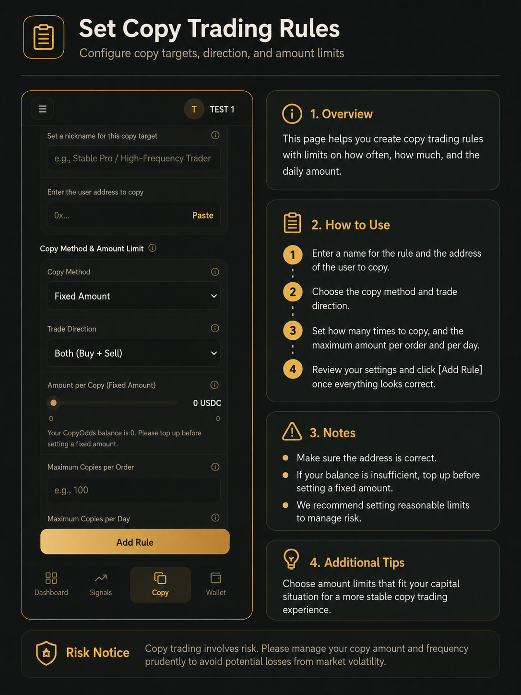

# 开始跟单

设置跟单后，CopyOdds 会在您关注的交易员成交时，自动在您的账户下尝试下单。**是否跟单成功，请以「交易记录」为准**；「动态」页只展示交易员的公开动作，不代表您的订单已成交。

***

## 开启跟单前请确认

| 条件         | 说明                    |
| ---------- | --------------------- |
| 平台 Gas > 0 | **必须满足**，否则无法开启或恢复跟单  |
| USDC 余额    | 建议至少约 **$1**，用于实际买入跟单 |
| 交易账户已开通    | 登录后通常自动完成，一般无需手动操作    |

### 资金不足时会发生什么

| 情况            | 会怎样                | 您需要做什么                             |
| ------------- | ------------------ | ---------------------------------- |
| Gas 用完        | 跟单自动暂停             | 去商店购买 Gas，系统会自动尝试恢复；若未恢复，手动点「恢复跟单」 |
| USDC 不够买      | 买单会跳过，跟单规则**不会暂停** | 充值 USDC；有持仓时仍可跟卖                   |
| USDC 和 Gas 都够 | 正常跟单               | 无需操作                               |

***

## 设置跟单规则

### 操作步骤

1. 进入「**跟单**」页面，点击「新增跟单」；或在聪明钱详情页点「去跟单」（地址会自动填入）。
2. 填写规则名称和要跟单的**用户地址**（务必核对正确）。
3. 选择跟单方式：**按比例** 或 **固定金额**。
4. 选择跟单方向：双向、只跟买或只跟卖。
5. 设置每次跟多少、单笔最大、每日最多、单市场上限和滑点。
6. 确认 Gas 大于 0 后，点击「**跟单**」保存。

_跟单设置页：填写交易员地址、跟单方式、方向与金额上限。_

### 跟单方式说明

* **按比例**：按交易员成交规模的一定比例跟单。例如设 0.5，表示跟一半。
* **固定金额**：每笔跟单使用相同的美元金额。

### 最小下单说明

Polymarket 每笔买入至少需要约 $1。如果按比例算出来的金额太小，可以选择「跳过」或「抬到最小金额」（固定金额模式默认会抬到最小）。

### 注意事项

* 地址必须填写正确，建议先用小比例或小金额测试。
* Gas 为 0 时无法开启跟单。
* 修改规则只影响之后的跟单，不会改变已有记录。

***

## 管理已有跟单

### 操作步骤

1. 进入「跟单」页面，在「我正在跟单的人」中找到对应规则。
2. 若跟单意外停止，先查看卡片上的提示信息。
3. **编辑**：修改跟单方式、金额、滑点、方向等。
4. **停止**：暂停跟单，可随时恢复。
5. **恢复**：在 Gas 或参数问题修复后重新开启。
6. **删除**：彻底移除，该地址后续成交不再跟单。

### 停止与删除的区别

* **停止**：暂时关闭，满足条件后可恢复，历史记录保留。
* **删除**：彻底移除，需要重新创建规则才能再跟该地址。

### 注意事项

* 停止跟单**不会自动卖出您的持仓**，请在「交易」页管理持仓。
* 删除规则不会自动提现 USDC 或处理已有持仓。

***

## 查看动态

动态页展示您正在关注的交易员的最新买卖动作，方便观察对方是否还在活跃交易。

### 操作步骤

1. 进入「**动态**」页面。
2. 查看正在跟单的人列表与当前状态。
3. 切换 **全部 / 买入 / 卖出 / 关注中** 筛选。
4. 查看每条动态的地址、方向、规模与时间。

_动态页：展示交易员的买卖动作，不代表您的跟单已成功。_

### 注意事项

* 动态会定时刷新；页面为空可能是尚无跟单规则，或交易员暂无新交易。
* **动态 ≠ 跟单成功**，执行结果请到「交易记录」查看。
