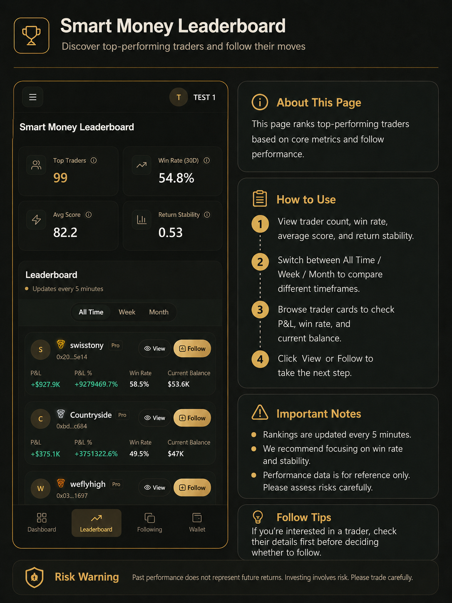

# 排行榜说明

「聪明钱」排行榜用于查看系统统计的交易员表现，帮助您选择合适的跟单对象。数据基于公开交易记录与统计模型，**不构成投资建议，也不保证未来收益**。

---

## 查看聪明钱排行榜

### 操作步骤

1. 进入「**聪明钱**」页面。
2. 查看榜单汇总：交易员数量、平均胜率、平均评分和收益稳定性。
3. 切换统计周期：**全部时间**、**周榜**、**月榜**。
4. 浏览交易员卡片，查看盈利、胜率、交易次数、当前资金与风险标记。
5. 使用搜索或筛选查找目标交易员。
6. 点击「**查看详情**」进入详情页，查看收益走势、最大回撤、持仓估值等。
7. 确认要跟单时，点击「**去跟单**」或「跟单」。

*排行榜页：切换周期并浏览交易员卡片，进入详情或发起跟单。*

---

## 如何解读指标

- **胜率**：胜率高不代表一定赚钱，需结合交易次数与样本量。
- **收益与回撤**：历史收益不代表未来收益；关注收益稳定性与最大回撤。
- **风险标记**：系统可能标注高风险行为，请综合判断。
- **交易次数**：样本过少时指标参考价值有限。

---

## 使用建议

- 不建议只看单一指标就直接跟单。
- 新用户建议先 **小金额测试**，熟悉充值、Gas、跟单规则与交易记录后再逐步放大。
- 排行榜与详情页数据仅供参考；跟单前请自行评估风险承受能力。

### 注意事项

- 收益数据仅供参考，过去表现不代表未来收益。
- 胜率高 ≠ 一定盈利；建议结合交易次数、稳定性与风险标记综合判断。
