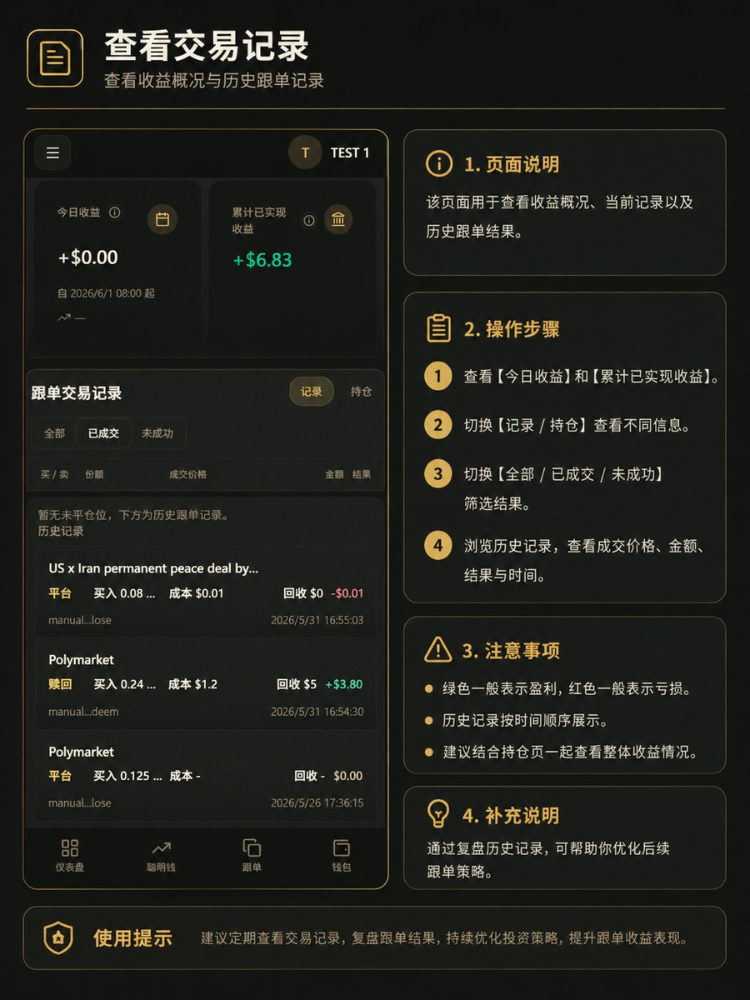

# 订单与记录

「交易记录」是跟单执行账本：每次尝试镜像 leader 成交的记录，含状态、价格/数量、失败原因、持仓与已实现盈亏。**调试跟单问题请优先查看本页，而非动态页。**

---

## 查看交易记录

### 操作步骤

1. 进入「**交易**」页面。
2. 查看 **今日收益** 和 **累计已实现收益**。
3. 切换 **记录** 与 **持仓** 查看不同信息。
4. 切换 **全部 / 已成交 / 未成功**（或已跳过）筛选结果。
5. 浏览每一行：时间、leader 地址、市场、方向、意向价格、数量、名义金额与错误码。
6. 在持仓区查看并平仓或 redeem（市场允许时）。

*交易记录页：查看跟单尝试状态、盈亏与持仓管理。*

---

## 状态含义

| 状态 | 说明 |
|------|------|
| **已成交** | 订单在 Polymarket 成交 |
| **已跳过** | 风控或业务规则拦截（未下单或数量为 0） |
| **失败** | 订单被拒或出错，见错误码 |
| **提交中** | 仍在处理 |
| **资金不足，已跳过买入** | USDC 不够下买单；有持仓时 leader 每次买入可能产生一条，属正常跳过，非系统故障 |

---

## 常见跳过 / 失败原因

- `below_min_notional`：比例买单太小且设为跳过模式
- `side_filter`：leader 方向与只买/只卖设置不符
- `slippage`：价格超出滑点容忍
- `daily_cap` / `max_amount` / `market_amount`：触及上限
- `market_cooldown`：该市场仍在成交后冷却期
- `fail_streak`：连续失败过多，订阅已暂停
- `ignored_no_position_sell` / `user_insufficient_shares`：无份额可卖
- `user_gas_insufficient`：平台 Gas 不足；买 Gas 后手动恢复规则
- `user_collateral_insufficient`：USDC 不足无法买入
- `clob_no_liquidity`：卖单无即时对手盘
- `clob_rate_limit` / `clob_timeout` / `clob_network_error`：上游临时问题

---

## 动态 vs 交易记录

| | 动态 | 交易记录 |
|---|------|----------|
| 内容 | 已启用订阅的 leader 最近公开动作 | CopyOdds 是否实际提交并成功成交您的镜像单 |
| 用途 | 观察 leader 是否活跃 | 确认跟单结果、排查失败原因 |

修改规则或充值后，务必在交易记录确认跟单结果。

---

## 注意事项

- 无持仓的卖单跳过属正常，可能不计入失败统计。
- 长期 USDC 不足但有持仓时，leader 频繁买入会产生大量「资金不足，已跳过买入」——补 USDC、暂停规则或降低比例即可。
- 持仓区会区分可卖、小额（dust）、无流动性；平仓和 redeem 前请核对市场与数量。
- 联系支持时请保留错误码与交易记录编号。
