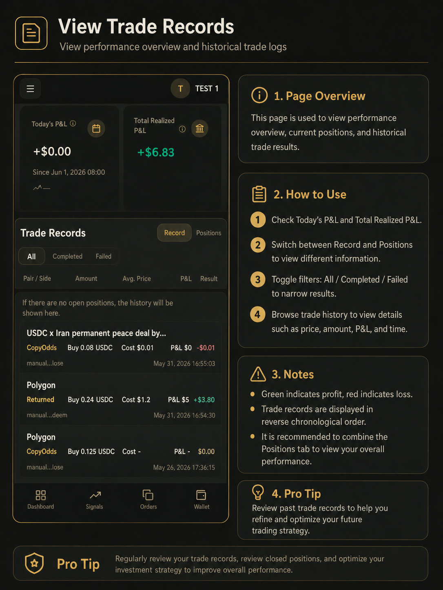

# 订单与记录

「交易记录」是跟单执行的结果页，记录每次跟单尝试是否成功。**排查跟单问题请优先看本页，不要只看动态页。**

***

## 查看交易记录

### 操作步骤

1. 进入「**交易**」页面。
2. 查看 **今日收益** 和 **累计已实现收益**。
3. 切换 **记录** 与 **持仓** 查看不同信息。
4. 切换 **全部 / 已成交 / 未成功** 筛选结果。
5. 浏览每一条记录：时间、交易员地址、市场、方向、价格、数量和状态。
6. 在持仓区查看当前持仓，需要时可手动平仓。

_交易记录页：查看跟单结果、盈亏与持仓管理。_

***

## 状态说明

| 状态             | 含义                          |
| -------------- | --------------------------- |
| **已成交**        | 跟单订单已成功成交                   |
| **已跳过**        | 因设置或资金原因未下单（见下方常见原因）        |
| **失败**         | 下单被拒或出错                     |
| **提交中**        | 仍在处理中                       |
| **资金不足，已跳过买入** | USDC 不够下买单；有持仓时规则仍在运行，属正常情况 |

***

## 常见跳过或失败原因

遇到未成功的记录时，通常属于以下几类：

### 跟单设置相关

* **方向不符**：您设置了只跟买或只跟卖，与交易员方向不一致
* **金额太小**：按比例算出的金额低于约 $1 最低买入额
* **触及上限**：超过您设置的单笔最大、每日最多或单市场上限
* **滑点过大**：市场价格偏离交易员成交价超过您设置的滑点范围
* **市场冷却中**：同一市场短时间内已跟过单，在冷却期内不再重复跟

### 资金相关

* **Gas 不足**：平台 Gas 已用完，需去商店购买
* **USDC 不足**：余额不够下买单；有持仓时买单会跳过，但卖单仍可尝试
* **没有可卖份额**：交易员卖出时，您没有对应市场的持仓，卖单会跳过

### 市场相关

* **暂无对手盘**：卖出时市场上暂时没有买家
* **网络临时异常**：上游服务暂时不可用，可稍后重试

### 怎么处理

| 原因类型    | 建议操作            |
| ------- | --------------- |
| Gas 不足  | 去商店购买 Gas       |
| USDC 不足 | 充值 USDC，或降低跟单比例 |
| 金额太小    | 改用固定金额模式，或调大比例  |
| 没有可卖份额  | 正常情况，无需处理       |
| 网络异常    | 等待后刷新，持续出现请联系客服 |

***

## 动态 vs 交易记录

|      | 动态         | 交易记录        |
| ---- | ---------- | ----------- |
| 展示内容 | 交易员的最新买卖动作 | 您的跟单是否实际成交  |
| 适合用来 | 观察交易员是否活跃  | 确认跟单结果、排查问题 |

修改规则或充值后，请到交易记录确认跟单是否恢复正常。

***

## 注意事项

* 交易员卖出而您没有对应持仓时，卖单跳过是正常现象。
* USDC 不足但有持仓时，交易员每次买入可能产生一条「资金不足，已跳过买入」，补足 USDC 或降低比例即可。
* 平仓前请核对市场和数量。
* 联系客服时，请保留交易记录中的状态信息和编号。
