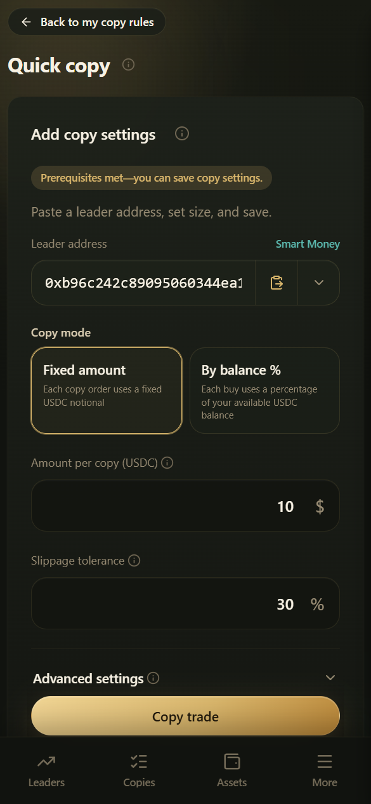

# किसी ट्रेडर को कॉपी कैसे करें

किसी स्मार्ट मनी एड्रेस को ऑटोमेटेड कॉपी में जोड़ें और नियम सेव करें।

***

## शुरू करने से पहले की चेकलिस्ट

| शर्त | नोट्स |
|-----------|-------|
| एक्टिव ट्रेडिंग अकाउंट के साथ लॉग इन | आमतौर पर लॉगिन के बाद अपने-आप खुल जाता है |
| प्लेटफ़ॉर्म Gas > 0 | **ज़रूरी**; वरना आप चालू / फिर से शुरू नहीं कर सकते |
| उपलब्ध USDC बैलेंस | लगभग $1 या उससे ज़्यादा की सलाह; वरना buys स्किप होने की संभावना है |

***

## एंट्री पॉइंट्स

इनमें से कोई भी:

1. **Smart money** लिस्ट या प्रोफ़ाइल पेज पर **Follow** (फ़ॉलो करें) पर टैप करें
2. **My copies** में **Quick copy / New copy**
3. सीधे `/copier` (Quick copy) खोलें और एड्रेस पेस्ट करें
4. प्रोफ़ाइल लिंक `https://app.copyodds.io/@0x...` खोलें और Follow पर टैप करें

***

## चरण

1. **Leader address** (0x…) की पुष्टि करें; लीडरबोर्ड से लाने पर टाइपिंग की ग़लतियों से बचते हैं
2. वैकल्पिक: नियम को नाम दें (Name this copy trade)
3. एक **Copy mode** चुनें — तीन में से एक:
   - **Ratio** — **डिफ़ॉल्ट मोड**; लीडर के हर फ़िल का एक तय प्रतिशत कॉपी करता है (लीडर 10% ratio पर $500 का खरीदता है → आप $50 का खरीदते हैं)
   - **By balance %** — **आपके उपलब्ध USDC** का एक प्रतिशत (1%–100%)
   - **Fixed amount** — हर बार एक ही राशि की खरीद (न्यूनतम $1)
4. **Slippage tolerance** सेट करें — डिफ़ॉल्ट **15%**, 1% से 100% तक बदला जा सकता है

   > तीनों मोड में क्या अंतर है, ratio की गणना कैसे होती है, और सुझाए गए मान कहाँ से आते हैं, यह जानने के लिए देखें [तीन कॉपी मोड](copy-modes.md)
5. वैकल्पिक रूप से **Advanced settings** खोलें:
   - **Direction**: Both / Buy only / Sell only
   - **Max open copy buys**: डिफ़ॉल्ट **1** (पोज़िशन में और नहीं जोड़ना); अधिकतम **All (असीमित)** है
6. सेव करें (**Copy trade / Save**)
7. **My copies** में जाएँ और पुष्टि करें कि स्टेटस **Following** है

***

## फ़िक्स्ड राशि बनाम बैलेंस का %

| मोड | व्यवहार | किसके लिए सबसे अच्छा |
|------|----------|----------|
| फ़िक्स्ड राशि | ट्रेडर चाहे $50 का खरीदे या $500 का, आप अपनी सेट की गई राशि से कॉपी करते हैं | प्रति ट्रेड जोखिम नियंत्रित करना |
| बैलेंस का % | उस समय आपके उपलब्ध बैलेंस के % से buys कॉपी करता है | आपकी पूँजी के साथ अपने-आप घटना-बढ़ना |

अगर प्रतिशत से गणना की गई राशि न्यूनतम ऑर्डर साइज़ से कम हो, तो सिस्टम कोशिश करने से पहले उसे न्यूनतम तक बढ़ा सकता है।

***

## नोट्स

- हर लीडर एड्रेस के लिए आमतौर पर केवल एक एक्टिव सेटिंग्स सेट होता है; दोबारा सेव करने पर पुराना बदल जाता है
- नियम बदलने से केवल भविष्य की कॉपीज़ पर असर पड़ता है, पिछले फ़िल्स नहीं बदलते
- नियम रोकने / डिलीट करने से आपकी पोज़िशन्स अपने-आप **नहीं** बिकतीं
- पहले छोटी राशि से टेस्ट करें, और Trade history सामान्य दिखने के बाद ही राशि बढ़ाएँ

***

## कॉपी करने के बाद कहाँ देखें

| आप क्या देखना चाहते हैं | कहाँ जाएँ |
|----------------------|-------------|
| ट्रेडर ने अभी क्या किया, और क्या मैंने उसे कॉपी किया | [कॉपी एक्टिविटी](copy-activity.md) |
| मेरे पास अभी क्या है | [मेरी पोज़िशन्स और ट्रेड हिस्ट्री](positions-and-records.md) |
| नियम का स्टेटस, पॉज़ / फिर से शुरू | [कॉपी मैनेज करना](managing.md) |
