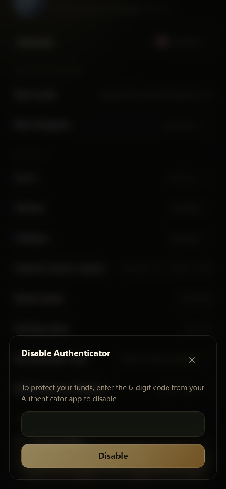

# विड्रॉल सुरक्षा

विड्रॉल से फ़ंड्स किसी बाहरी एड्रेस पर जाते हैं, इसलिए हर विड्रॉल के लिए **स्टेप-अप वेरिफ़िकेशन** ज़रूरी है। फ़िलहाल केवल **Authenticator (TOTP)** समर्थित है।

***

## वेरिफ़िकेशन का तरीका

- **एकमात्र तरीका: Authenticator कोड** (Google / Microsoft Authenticator, 1Password आदि)
- अगर कोई Authenticator बाइंड नहीं है, तो विड्रॉल फ़्लो आपसे पहले Settings में इसे चालू करने के लिए कहेगा
- **Passkeys और ईमेल कोड का उपयोग विड्रॉल के लिए नहीं किया जा सकता** (ये लॉगिन आदि के लिए अभी भी काम करते हैं)

आप Settings में "Withdrawal step-up verification" का विवरण पा सकते हैं।

***

## विड्रॉ करते समय क्या करें

1. सुनिश्चित करें कि Authenticator बाइंड है
2. विड्रॉ पेज पर Polygon एड्रेस और राशि भरें और उन्हें दोबारा जाँचें
3. स्टेप-अप वेरिफ़िकेशन डायलॉग में, 6-अंकों का कोड डालें
4. वेरिफ़िकेशन पास होने के बाद विड्रॉल सबमिट करें

अगर कोड ग़लत है या एक्सपायर हो गया है, तो बस मौजूदा कोड फिर से डालें।

***

## अतिरिक्त सुरक्षा

| व्यवस्था | विवरण |
|-----------|-------------|
| Max withdrawable | पोज़िशन्स और ऑर्डर्स में लगे फ़ंड्स विड्रॉ नहीं किए जा सकते |
| नया डिवाइस / नया नेटवर्क कूलडाउन | डिवाइस बदलने या IP बदलने के बाद विड्रॉल अस्थायी रूप से उपलब्ध नहीं हो सकते |
| विड्रॉल चैनल व्यस्त | पीक समय पर आपको मिनटों से लेकर घंटों तक इंतज़ार करना पड़ सकता है; आपके फ़ंड्स सुरक्षित हैं |
| डेस्टिनेशन वॉलेट में MATIC चाहिए | नए एड्रेस में थोड़ा MATIC (POL) रखें, वरना बाद में आप इस USDC को ऑन-चेन मूव नहीं कर पाएँगे |
| ट्रेडिंग प्रतिबंध | अगर अकाउंट की ट्रेडिंग प्रतिबंधित है, तो विड्रॉल भी प्रभावित हो सकते हैं |
| एड्रेस की जाँच | ग़लत बाहरी एड्रेस पर भेजे गए फ़ंड्स आमतौर पर वापस नहीं मिल सकते |

***

## सुरक्षा सुझाव

- सपोर्ट होने का दावा करने वाले किसी को भी कभी अपना Authenticator कोड न दें
- किसी के दिए गए "इंटरमीडिएट एड्रेस" पर विड्रॉल एड्रेस कभी न बदलें
- आधिकारिक ईमेल डोमेन की जानकारी के लिए, देखें [एंटी-फ़िशिंग](anti-phishing.md)
- बड़े विड्रॉल से पहले: छोटी राशि से टेस्ट करें → पुष्टि करें कि वह पहुँच गई → फिर और विड्रॉ करें
