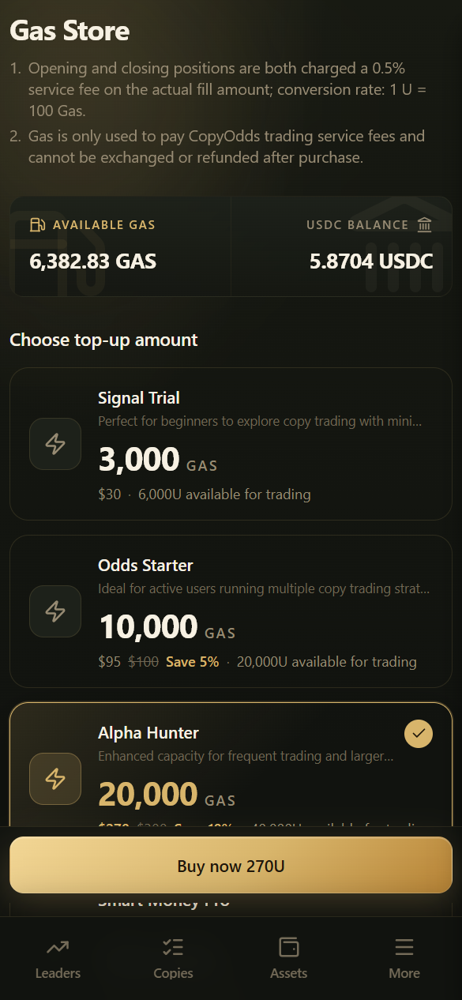

# Mulai Cepat

Ikuti langkah-langkah ini untuk mulai dari membuka App hingga aturan copy pertama Anda. Selalu gunakan domain resmi **copyodds.io / app.copyodds.io**.

***

## 1. Masuk atau buat akun

1. Buka App dan masuk ke **Login**.
2. Masukkan email Anda → **Send code** (kirim kode) → masukkan kode 6 digit → masuk.
3. **Email baru otomatis membuat akun** (tidak ada halaman pendaftaran terpisah dengan nama Anda; jika layar masih meminta nama / persetujuan ketentuan, cukup ikuti petunjuknya).
4. Opsional: masuk dengan **Passkey** atau **Telegram**.
5. Jika Anda datang melalui tautan undangan, kode undangan biasanya terisi otomatis.

### Catatan

- Kode biasanya berlaku sekitar 5 menit; Anda tidak dapat langsung mengirim ulang setelah mengirim
- Jika email tidak masuk, periksa folder spam / promosi Anda
- Passkey harus didaftarkan pada perangkat dan browser yang didukung (kelola di Pengaturan)

***

## 2. Deposit USDC / USDT

1. Buka **Assets / Deposit** → `/wallets/deposit`
2. **Pilih jaringan**: Polygon (PoS) atau BSC (harus sesuai dengan jaringan yang Anda gunakan untuk menarik dana dari bursa Anda)
3. **Pilih aset**: hanya USDC atau USDT
4. Salin alamat di halaman ini atau pindai kode QR untuk mentransfer (**alamat Polygon dan BSC berbeda — jangan pernah tertukar**)
5. Tunggu konfirmasi on-chain; BSC mungkin memerlukan beberapa menit tambahan

Lihat [Deposit](../wallet/deposit.md) dan [Jaringan yang Didukung](../wallet/supported-networks.md) untuk detailnya.

***

## 3. Beli Gas Platform

1. Buka **Gas Store** → `/store`
2. Periksa saldo Gas dan USDC Anda saat ini
3. Pilih paket → bayar dengan USDC kustodian Anda
4. Gas langsung dikreditkan (tidak dapat ditarik)

Ringkasan biaya: setiap transaksi copy memakan sekitar **0.5%** dari nilai nominalnya dalam Gas; **1 USDC ≈ 100 Gas**. Lihat [Gas Platform](../wallet/gas.md).

***

## 4. Pilih trader dan copy

1. Buka halaman beranda **Leaderboard** atau **Smart money** → `/` atau `/smart-money`
2. Gunakan kategori, filter cepat, atau filter lanjutan untuk memilih trader
3. Ketuk **Follow** (ikuti), atau buka profilnya terlebih dahulu lalu ikuti dari sana
4. Pilih **mode copy** (default **Ratio**), slippage, dan opsi lanjutan
5. Pastikan Gas > 0, lalu simpan → kelola di **My copies**

***

## 5. Periksa apakah copy berjalan

| Halaman | Tujuan |
|------|---------|
| **My copies** | Apakah aturan aktif dan apakah ada peringatan dana |
| **Trade history** | Apakah order Anda terisi / dilewati / gagal |
| **Copy activity** | Tindakan publik trader (**bukan** transaksi Anda) |
| **Positions** | Posisi Anda saat ini; tutup / tukarkan di sini |

***

## Tips untuk pemula

- Mulailah dengan deposit kecil, beli sedikit Gas, dan uji dengan jumlah tetap yang kecil selama 1–2 hari
- Saat dana atau Gas menipis, pembelian dilewati tetapi aturan biasanya **tidak** dijeda secara otomatis; setelah mengisi saldo, buka **My copies** dan ketuk **Resume buys** (lanjutkan pembelian)
- Penarikan hanya mendukung **Polygon USDC** — periksa ulang alamat sebelum mengirim

***

## Tidak yakin siapa yang harus di-copy? Dua pendekatan aman

1. **Periksa Leaderboard terlebih dahulu** (halaman beranda) untuk menemukan akun dengan kinerja terbaru yang stabil, lalu verifikasi skor dan drawdown di halaman profil
2. **Masih ragu? Coba [Simulasi copy trading](../copy-trading/simulation.md) terlebih dahulu** — tanpa melibatkan uang sungguhan

Setelah Anda yakin, kembali ke langkah 4 di halaman ini untuk memulai copy sungguhan.
