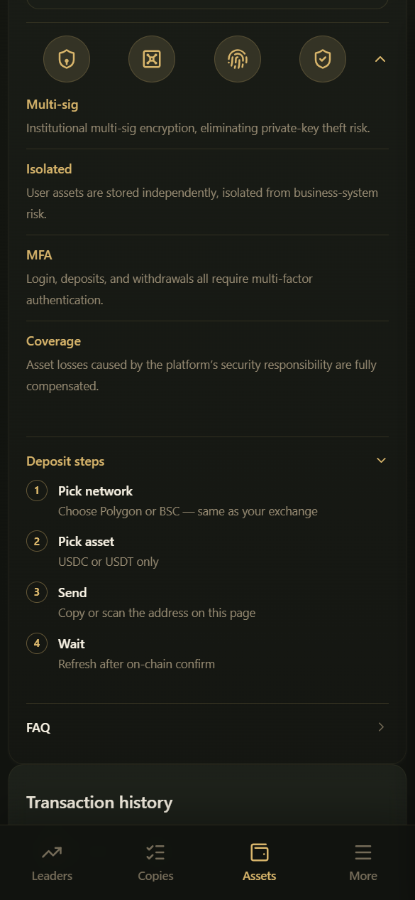

# Keamanan Dompet

CopyOdds menggunakan model **akun trading kustodian**: Anda tidak perlu menjaga private key trading sendiri, tetapi Anda perlu melindungi metode masuk dan verifikasi penarikan Anda.

Deskripsi lengkap di App: **Asset security guarantee** → `/wallets/security`.

***

## Mekanisme inti

| Kemampuan | Deskripsi |
|------------|-------------|
| **Dompet khusus** | Setiap pengguna memiliki dompet kustodian tersendiri; aset dikelola secara terisolasi |
| **Isolasi private key** | Private key dompet dienkripsi dan diisolasi secara terpisah, tidak pernah terekspos langsung ke antarmuka trading sehari-hari |
| **Perlindungan penarikan** | Penarikan memerlukan verifikasi tambahan; perubahan pada pengaturan keamanan utama dapat memicu verifikasi ulang / masa tunggu |

***

## Jaminan keamanan platform (ringkasan)

Jika aset pengguna hilang sebagai akibat langsung dari insiden keamanan pada **platform CopyOdds itu sendiri**, seperti celah keamanan atau pembobolan server, platform akan memberikan kompensasi sesuai dengan kebijakan jaminan keamanannya (tunduk pada halaman produk dan ketentuan hukum).

Harap diperhatikan:

- Platform **tidak akan pernah** meminta seed phrase, private key, kata sandi, atau kode verifikasi Anda melalui pesan langsung, email, atau dukungan
- Kerugian trading pasar prediksi, kesalahan pengguna (rantai salah, alamat salah), penipuan phishing, dll. tidak tercakup dalam "kompensasi insiden keamanan platform"
- Selalu gunakan domain resmi

***

## Yang perlu Anda lakukan sendiri

1. Hanya gunakan situs web / App resmi: **copyodds.io**
2. **Aktifkan Authenticator** (wajib untuk penarikan; lihat [Autentikasi Dua Faktor (2FA)](2fa.md))
3. Secara opsional tambahkan Passkey untuk mempermudah masuk
4. Tinjau secara berkala [perangkat yang telah masuk](../account/devices-and-passkeys.md) dan hapus perangkat yang tidak Anda kenali
5. Lakukan deposit menggunakan alamat di halaman, dan periksa dengan **Verify deposit address**
6. Uji deposit dan penarikan pertama Anda dengan jumlah kecil

***

## Halaman terkait

- Deposit / Penarikan: `/wallets/deposit`, `/wallets/withdraw`
- Pengaturan keamanan: `/settings`
- Manajemen perangkat: `/settings/devices`
- Passkey: `/settings/passkeys`

***

## Ingin memeriksa sendiri?

- Pergerakan dana dan pengeluaran Gas: **Transaction history** → `/wallets/ledger` (lihat [Riwayat Transaksi](../wallet/ledger.md))
- Perangkat yang pernah Anda gunakan untuk masuk dan masa tunggu penarikan: **Settings → Devices** → `/settings/devices` (lihat [Perangkat & Passkey](../account/devices-and-passkeys.md))
