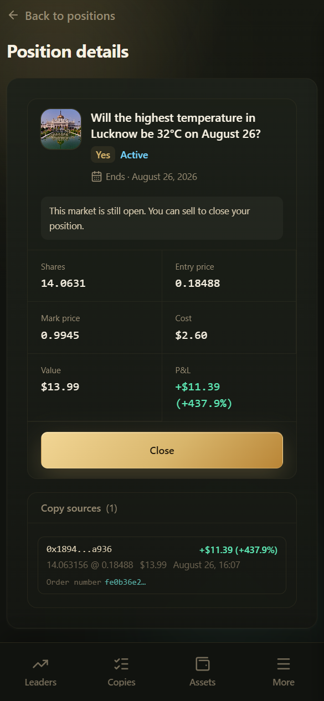

# Trader Profile

交易员详情页展示单个钱包的画像：评分、资金与表现、曲线、持仓、成交，以及跟单入口。

**链接格式：**

- 英文：`https://app.copyodds.io/@0x交易员地址`
- 中文：`https://app.copyodds.io/zh/@0x交易员地址`

> 部分旧路径（如含 `address` 字样）可能被广告拦截，优先使用 `/@0x...`。

***

## 页面结构（常见模块）

1. **交易员评分** — 综合分、推荐/适合标签、风险、入榜 / 不能入榜原因、因子得分
2. **资金与表现** — 当前资金、总盈亏、成交量、胜率等快照
3. **盈亏曲线** — 历史权益 / PnL 走势
4. **持仓 / 成交记录** — 对方当前持仓与近期交易
5. **跟单仿真** — 延迟 + 滑点假设下的可跟性相关结果
6. **真实跟单成绩** — 有足够样本时展示跟单 ROI、盈亏、订阅人数等
7. **操作** — **Follow（跟单）**；若开启模拟跟单功能，可能另有 Simulation 入口

***

## 如何从详情发起跟单

1. 核对地址与评分、风险提示
2. 点击 **Follow**
3. 在向导中设置金额 / 比例、滑点与高级选项
4. 保存后到 **My copies** 确认规则状态为 Following

详见 [How to Follow a Trader](../copy-trading/how-to-follow.md)。

***

## 读详情时的注意点

- 「评分计算中」时，部分因子与入榜原因可能稍后才完整显示
- 仿真区块明确标注假设条件时，不要当成已实现收益
- 真实跟单样本不足时，界面可能提示暂以仿真为准
- 分享给他人时请用官方详情链接，并提醒对方核对域名 **copyodds.io**
