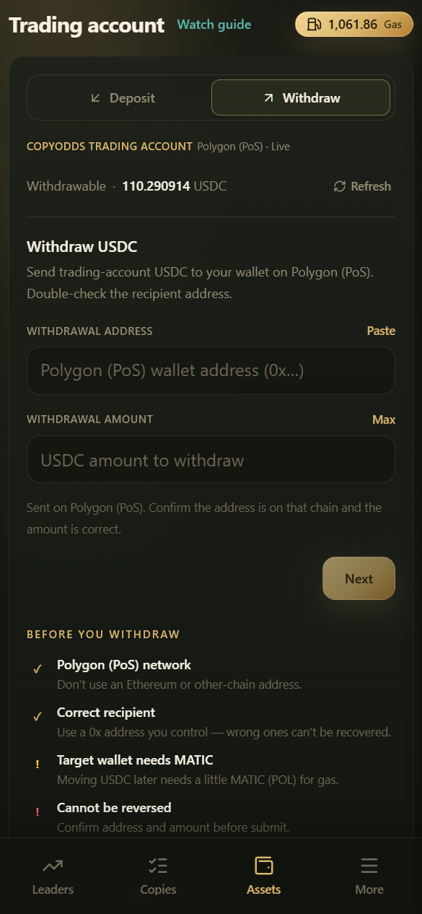

# Withdraw

将交易账户中可自由支配的 **USDC** 提到外部钱包。入口：**Wallets → Withdraw** → `/wallets/withdraw`。

***

## 提现规则

| 项 | 说明 |
|----|------|
| 网络 | **仅 Polygon (PoS)** |
| 资产 | **USDC** |
| 收款地址 | 必须能接收 Polygon USDC；**不要**填充值页托管地址 |
| 二次验证 | 每次提现需 step-up（见下） |

***

## 操作步骤

1. 打开提现页，查看 **最大可提**（可能小于总余额）
2. 输入 Polygon 收款地址与金额
3. 核对网络、地址、金额
4. 点击继续，完成 **提现二次验证**
5. 提交后在账单 / 记录中跟踪状态

***

## 为什么「最大可提」小于余额？

以下资金通常不可立即提出：

- 未平仓持仓占用
- 未成交挂单冻结
- 其它系统锁定的保证金 / 占用

请以页面 **最大可提** 为准，不要按总余额全额提。

***

## 提现二次验证

每次提现需使用 **Authenticator（TOTP）** 动态验证码确认。

若尚未绑定 Authenticator，系统会引导你前往设置开启；**未开启无法提现**。

Passkey、邮箱验证码仅用于登录等场景，**不能**用于提现确认。

详见 [Withdrawal Security](../security/withdrawal-security.md)、[2FA](../security/2fa.md)。

***

## 临时无法提现？

可能原因：

- 新设备登录或安全策略触发的提现冷却
- 交易状态被限制
- 二次验证失败 / 过期
- 地址或金额校验不通过

可到 **Settings → Devices / Security** 检查会话与安全设置；仍失败请联系支持并说明是否刚换设备。

***

## 安全建议

- 首次大额前提现：先小额测试到账
- 提交后通常无法撤销，地址务必逐位核对
- CopyOdds 不会在私信里要你「协助提现」或索要验证码
